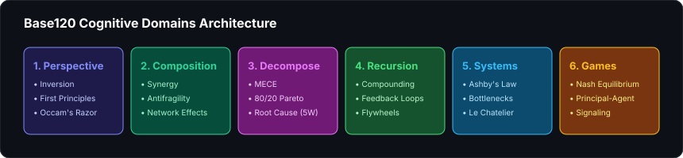

# base120-mcp

<div align="center">

[](https://github.com/hummbl-dev/base120-mcp)
[-brightgreen?style=for-the-badge)](https://github.com/hummbl-dev/base120-mcp)
[](https://modelcontextprotocol.io)
[](LICENSE)

<br/>

**120 validated mental models packaged as an MCP server to upgrade reasoning, prompt engineering, and architectural decisions in Claude Desktop, Cursor, and Windsurf.**

[Quickstart](#quickstart) • [The 6 Domains](#the-6-reasoning-domains) • [Claude Desktop Setup](#claude-desktop-setup) • [Engineering Verification](#engineering-rigor--verification)

</div>

---

## The 6 Reasoning Domains

<div align="center">
  
</div>

---

## What is Base120?

Most AI agents struggle with complex, ambiguous problems because they default to single-perspective reasoning. 

**Base120** is a structured library of 120 operational mental models (Inversion, First Principles, Ashby's Law of Requisite Variety, Nash Equilibrium, Antifragility) that give LLMs the exact operators needed to deconstruct hard engineering challenges.

---

## Claude Desktop Setup

Add `base120-mcp` directly to your `claude_desktop_config.json`:

```json
{
  "mcpServers": {
    "base120": {
      "command": "python",
      "args": ["-m", "base120_mcp.server"]
    }
  }
}
```

Now you can ask Claude in natural language:
> *"Use Base120 Inversion and Ashby's Law to critique our new distributed task queue architecture."*

---

## MCP Tools Provided

1. **`base120_search`**: Search mental models by domain or problem description.
2. **`base120_apply`**: Generate structured reasoning scaffolds for applying a specific model to an active problem statement.

---

## Engineering Rigor & Verification

- **Tests**: 100% passing test suite across Python 3.10-3.13.
- **Zero Dependencies**: Pure Python standard library (`json`, `sys`, `dataclasses`).
- **Author**: [Reuben Bowlby](https://reubenbowlby.com) — [LinkedIn](https://linkedin.com/in/reubenbowlby) | [Resume](https://reubenbowlby.com/resume)

---

## Enterprise Core

Base120 is the cognitive reasoning core of the **HUMMBL** platform. For enterprise multi-agent governance and formal Lean 4 verification, visit **[`github.com/hummbl-io`](https://github.com/hummbl-io)**.

---

<div align="center">
  <sub>Dual-licensed under Apache 2.0 and MIT.</sub>
</div>
